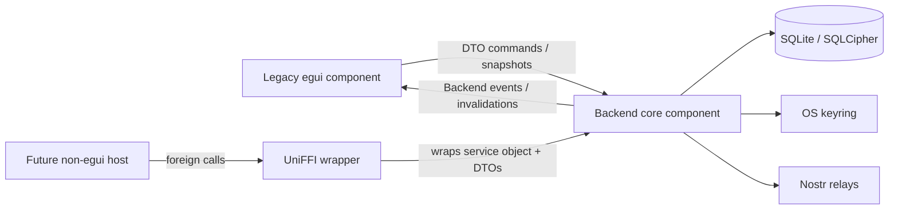

# Hoot egui/backend split map

Date: 2026-06-28

Implementation status: the split described here has been executed. The repository now uses a Cargo workspace with `crates/hoot-backend` for backend/database/relay/Nostr ownership and `crates/hoot-egui` for the desktop binary named `hoot`. Sections that reference root `src/**`, root `migrations/**`, or single-package `Cargo.toml` are the pre-split baseline captured for traceability.

## Purpose

This document was written while Hoot was one Rust binary where the egui desktop shell, persistence, Nostr relay transport, account/key administration, event ingestion, and local caches all met inside `Hoot`.

The target split is:

1. **Legacy egui component**: current desktop UI, page/window state, rendering, theme, texture cache, and user input buffers.
2. **Backend component**: administrative tasks, encrypted database, migrations, account/key management, relay pool, Nostr event ingestion, mail/domain operations, NIP-05/profile/contact/sender-status state, exposed later through UniFFI.

This document records the current code map and extraction seam found by four subagents:

- `UiExplorer`: egui surface and UI/backend crossings.
- `BackendExplorer`: database/admin/event-processing responsibilities.
- `RelayExplorer`: relay/Nostr flow and transport risks.
- `UniffiExplorer`: UniFFI-safe boundary candidates and crate layout.

The implementation now lives in a workspace. The original map below is retained as a record of the extraction seam and migration rationale.

## Pre-split crate shape

`Cargo.toml` defines one package named `hoot` with UI and backend dependencies in one dependency set:

- UI: `eframe`, `egui_extras`, `image` (`Cargo.toml:15-17`).
- HTTP/image/NIP-05 helpers: `reqwest` with `blocking` and Rustls (`Cargo.toml:18`).
- Relay/Nostr: `ewebsock`, `nostr` (`Cargo.toml:24-26`).
- Persistence: `rusqlite`, `rusqlite_migration`, `include_dir` (`Cargo.toml:30-39`).
- Secret storage: `keyring` (`Cargo.toml:40`).
- Cross-cutting: `serde`, `serde_json`, `anyhow`, `chrono`, `tracing` (`Cargo.toml:19-38`).

`src/main.rs` is both binary root and module root. It declares backend-ish modules (`account_manager`, `db`, `event_processing`, `mail_event`, `nip05`, `profile_metadata`, `relay`) and UI modules (`image_loader`, `style`, `types`, `ui`) together at `src/main.rs:8-20`, then re-exports `types` at `src/main.rs:21`.

## Component ownership target



### Keep in legacy egui

Keep all rendering and egui-only state in the old UI component:

- `src/main.rs` entrypoint: `main()`, `eframe::run_native`, native window options, font install, theme application (`src/main.rs:24-59`).
- `eframe::App` implementation and render scheduling (`src/main.rs:479-482`).
- `render_app`, `render_left_panel`, navigation, window routing, central page dispatch (`src/main.rs:140-337`).
- `src/ui/**` render functions and widget-local state.
- `src/style.rs` theme/colors/layout/timestamp formatting (`src/style.rs:6-82`).
- `src/image_loader.rs` egui texture cache, `TextureHandle`s, and `ctx.load_texture` path (`src/image_loader.rs:13-84`).
- `Page`, window maps keyed by `egui::Id`, transient input buffers, selected rows, dropdown state, debounce timers, and hover/selection state.

### Move behind backend service

Move durable/admin/domain state behind a backend service object:

- `Db` and all `src/db/**` methods/migrations.
- `AccountManager` and keyring/public-key synchronization.
- `RelayPool`, `Relay`, `Subscription`, relay protocol codecs, auth retry state.
- `event_processing` relay message and Nostr event reducer logic.
- `MailMessage` conversion to Nostr/gift-wrapped events.
- Profile metadata and NIP-05 verification/resolution that affects identity state.
- Contacts, sender allow/junk status, drafts, trash/deletion semantics.
- Backend status and mailbox/message snapshots.

The legacy egui app should hold one backend handle plus UI snapshots, not `Db`, `RelayPool`, or `nostr::Keys` directly.

## Current central boundary problem: `Hoot`

`Hoot` currently combines both sides:

- UI routing/selection: `page`, `focused_post`, `show_trashed_post` (`src/main.rs:63-65`).
- Lifecycle/UI aggregate state: `status`, `state` (`src/main.rs:66-67`).
- Backend runtime state: `relays`, `events`, `account_manager`, `active_account`, `db` (`src/main.rs:68-72`).
- UI-visible caches: `table_entries`, `trash_entries`, `request_entries`, `junk_entries`, `profile_metadata`, `contacts_manager`, `drafts` (`src/main.rs:73-79`).
- Background identity queues: `nip05_verifier`, `nip05_resolver` (`src/main.rs:80-81`).

`Hoot::new` also performs backend setup from the UI host: it creates `eframe::storage_dir(STORAGE_NAME)`, creates `hoot.db`, opens `Db::new`, checks the `done` sentinel, and constructs relay/account/db/cache fields (`src/main.rs:352-399`).

Target shape:

```rust
// Sketch only, not implemented.
struct HootUiApp {
    page: Page,
    focused_post: String,
    show_trashed_post: bool,
    ui_state: HootUiState,
    backend: BackendClient,
    snapshots: ViewSnapshots,
}
```

Backend resources become private fields inside a service object, not public fields on the egui app.

## Backend responsibility map

### Database and migrations

`Db` wraps a `rusqlite::Connection` (`src/db/mod.rs:26-27`). It supports:

- File open: `Db::new(path)` (`src/db/mod.rs:31-36`).
- In-memory open: `Db::new_in_memory()` (`src/db/mod.rs:38-44`).
- SQLCipher unlock and migration execution: `unlock_with_password` uses `PRAGMA key` then runs embedded migrations (`src/db/mod.rs:46-53`).
- Status probes: `is_unlocked`, `is_initialized` (`src/db/mod.rs:56-74`).
- User-facing unlock error formatting: `format_unlock_error` (`src/db/mod.rs:88-100`).

Migrations define backend-owned storage:

- `events`: raw Nostr event JSON plus generated columns (`migrations/001-nostr_events/up.sql:1-10`).
- `profile_metadata`: latest profile metadata event fields (`migrations/002-contacts/up.sql:1-8`).
- `pubkeys`: local account public keys (`migrations/003-pubkey/up.sql:1-3`).
- `contacts`: user contacts and petnames (`migrations/004-user_contacts/up.sql:1-5`).
- `drafts`: local draft messages (`migrations/005-drafts/up.sql:1-10`).
- `deleted_events` and `gift_wrap_map`: deletion markers and wrapper-to-inner mapping (`migrations/006-deletions/up.sql:1-18`).
- `trash_events`: soft-delete retention (`migrations/007-trash/up.sql:1-8`).
- `sender_status`: allow/junk classification (`migrations/008-sender-status/up.sql:1-9`).
- `nip05_cache` and `profile_metadata.nip05`: NIP-05 identity cache (`migrations/009-nip05/up.sql:1-18`).

### Accounts and secrets

`AccountManager` owns local identity administration:

- `validate_nsec` parses and validates bech32 private keys (`src/account_manager.rs:10-19`).
- `loaded_keys: Vec<Keys>` caches private keys in memory (`src/account_manager.rs:22-24`).
- `generate_new_keys_and_save`, `save_keys`, `load_keys`, `delete_key` synchronize OS keyring secrets with DB public keys (`src/account_manager.rs:64-150`).
- `create_auth_event` signs NIP-42 relay auth events (`src/account_manager.rs:152-163`).

Current egui code directly holds/clones `nostr::Keys` (`src/main.rs:70-71`, `src/ui/compose_window.rs:15`, `src/ui/onboarding.rs:12-14`, `src/ui/add_account_window.rs:19-22`). The backend boundary should expose account descriptors and signing/send commands, not private keys.

### Relay and Nostr transport

`src/relay/mod.rs` is the WebSocket relay wrapper:

- `RelayStatus::{Connecting, Connected, Disconnected}` (`src/relay/mod.rs:15-20`).
- `RelayAuthState { challenge, authenticated_keys }` (`src/relay/mod.rs:22-26`).
- `Relay` owns URL, `ewebsock` receiver/sender, status, and auth state (`src/relay/mod.rs:28-34`).
- `Relay::new_with_wakeup`, `reconnect`, `send`, `try_recv`, `ping` manage socket lifecycle (`src/relay/mod.rs:37-115`).

`src/relay/pool.rs` coordinates fan-out/fan-in:

- `RelayPool` owns relay map, subscription map, reconnect/ping timers, and pending auth subscriptions (`src/relay/pool.rs:13-20`).
- `keepalive` reconnects every five seconds and pings every thirty seconds (`src/relay/pool.rs:37-62`).
- `add_subscription` stores a subscription and broadcasts a `REQ` (`src/relay/pool.rs:64-79`).
- `add_url`/`remove_url` manage relay URLs (`src/relay/pool.rs:81-94`).
- `try_recv` polls relays and replays subscriptions on socket open (`src/relay/pool.rs:96-143`).
- `send`, `send_auth`, auth-state helpers, pending-subscription helpers, and targeted retry live at `src/relay/pool.rs:176-250`.

`src/relay/message.rs` is the protocol codec:

- Inbound `RelayMessage::{Event, OK, Eose, Closed, Notice, Auth}` (`src/relay/message.rs:18-25`).
- Manual `RelayMessage::from_json` parser (`src/relay/message.rs:80-224`).
- Outbound `ClientMessage::{Event, Req, Close, Auth}` and array serializer (`src/relay/message.rs:226-291`).

### Event ingestion

`src/event_processing.rs` is currently the combined app tick and reducer:

- `update_app(app, ctx)` is called every frame and drives unlock/init, relay keepalive, incoming relay processing, contact image queue, NIP-05 queues, and cache refreshes (`src/event_processing.rs:33-109`).
- `try_recv_relay_message` pulls a raw relay message and parses it as `RelayMessage` (`src/event_processing.rs:24-30`).
- `process_message` handles relay protocol events, auth-required handling, pending subscription retry, and AUTH challenge storage (`src/event_processing.rs:142-190`).
- `apply_deletions` records deletion state, maps gift wraps, prunes in-memory events, resets UI focus/page, and refreshes lists (`src/event_processing.rs:192-280`).
- `process_event` validates Nostr events, handles deletion events, skips deleted/trashed/duplicate events, stores metadata, unwraps gift wraps, stores event data, and queues NIP-05 verification (`src/event_processing.rs:283-462`).

Extraction seam: split reducer output from UI side effects. Backend applies domain mutations and returns outcomes such as `MessageStored`, `DeletionApplied`, `MailboxChanged`, `MetadataUpdated`, `RelayStatusChanged`, and `AuthRequired`. Egui decides navigation, focus reset, and repaint.

### Mail, drafts, contacts, profile, NIP-05, sender status

- `MailMessage` is the current mail/domain struct with Nostr `EventId`/`PublicKey` fields and mail fields (`src/mail_event.rs:7-20`). `to_events` creates tags, builds custom kind `2024`, and gift-wraps one event per recipient (`src/mail_event.rs:23-69`).
- Draft persistence is cleanly backend-owned: `Draft` uses primitive/string fields (`src/db/drafts.rs:5-15`) and CRUD methods live at `src/db/drafts.rs:17-104`.
- Query methods return message projections and threads: top-level/trash/request/junk/search rows and thread messages (`src/db/queries.rs:9-392`).
- Contact/profile DB operations live in `src/db/contacts.rs`, but `ContactsManager` currently mixes contact data, DB CRUD, sorting, profile cache hydration, and egui image loading (`src/ui/contacts.rs:62-193`). Split data CRUD/name inputs into backend; keep avatar `TextureHandle` cache in egui.
- `Nip05Verifier` and `Nip05Resolver` use background threads and queues (`src/nip05.rs:57-207`). Verification state persists through `src/db/nip05.rs` methods.
- Sender allow/junk classification is backend state in `src/db/sender_status.rs`, with UI actions in requests/junk/thread/contacts pages.

## UI/backend crossings to remove

The current UI calls backend internals directly in several categories.

### Direct DB access from rendering/widgets

Examples:

- Inbox refresh calls `app.db.get_top_level_messages()` (`src/ui/inbox.rs:16-18`).
- Thread view calls `get_email_thread`, `get_email_thread_including_trash`, `get_trashed_event_ids`, sender-status reads/writes, NIP-05 cache reads, trash writes, and top-level refreshes (`src/ui/thread_view.rs:12-16`, `src/ui/thread_view.rs:33-63`, `src/ui/thread_view.rs:220-299`, `src/ui/thread_view.rs:375-413`).
- Compose saves/updates/deletes drafts through `app.db` (`src/ui/compose_window.rs:351-397`).
- Contacts CRUD and allowed-senders lists call DB methods (`src/ui/contacts.rs:75-151`, `src/ui/contacts.rs:462-538`).
- Requests/junk/trash mutate sender/trash status directly (`src/ui/requests.rs:122-140`, `src/ui/junk.rs:97-102`, `src/ui/trash.rs:105-121`).
- Search calls `app.db.search_messages` (`src/ui/search.rs:299-304`).

Target: widgets emit commands and consume snapshots/DTOs. Backend owns SQL/query semantics.

### Direct relay access from UI

Examples:

- Compose serializes `ClientMessage::Event` and sends raw `ewebsock::WsMessage::Text` through `app.relays.send` (`src/ui/compose_window.rs:239-247`).
- Settings adds/removes relays and iterates `app.relays.relays` directly (`src/ui/settings.rs:278-322`).
- `Hoot::update_gift_wrap_subscription` constructs a `nostr::Filter` and calls `self.relays.add_subscription` (`src/main.rs:430-457`).
- `profile_metadata::update_logged_in_profile_metadata` sends a relay event directly (`src/profile_metadata.rs:84-123`).

Target: backend exposes `send_message`, `publish_profile_metadata`, `add_relay`, `remove_relay`, `relay_statuses`, and internal subscription management.

### Direct account/key access from UI

Examples:

- Sidebar iterates `account_manager.loaded_keys` and stores `active_account: Option<nostr::Keys>` (`src/main.rs:242-258`).
- Compose stores `selected_account: Option<Keys>` (`src/ui/compose_window.rs:15`).
- Account setup validates/saves via `account_manager` and `Db` (`src/ui/account_setup.rs:15-82`).
- Settings deletes keys through `account_manager.delete_key(&app.db, &key)` (`src/ui/settings.rs:57-60`).

Target: UI stores an account ID/public key and displays `AccountDto`; backend stores secrets and performs signing/wrapping.

### Frame tick coupled to egui repaint

`event_processing::update_app` receives `egui::Context`, creates a `wake_up` closure calling `request_repaint`, then performs backend keepalive/receives and queue processing (`src/event_processing.rs:33-109`). `Relay::new_with_wakeup`, `Relay::reconnect`, and `RelayPool::add_url` accept this wake-up callback (`src/relay/mod.rs:37-67`, `src/relay/pool.rs:81-90`).

Target: backend exposes notifications/events. Egui maps notifications to `ctx.request_repaint`; UniFFI maps them to a callback, event queue, or host-driven poll.

## Candidate backend API surface

Use one service object as the public boundary. Do not expose `Db`, `AccountManager`, `RelayPool`, `nostr::Keys`, `nostr::Event`, `ewebsock` types, `rusqlite::Connection`, `anyhow::Error`, or egui types.

Sketch:

```rust
// Sketch only, not implemented.
pub struct HootBackend { /* private state */ }

impl HootBackend {
    pub fn open(storage_path: String) -> Result<Self, HootError>;
    pub fn unlock(&self, password: String) -> Result<BackendStatusDto, HootError>;
    pub fn initialize(&self) -> Result<InitialSnapshotDto, HootError>;
    pub fn tick(&self) -> Result<Vec<BackendEventDto>, HootError>;

    pub fn list_accounts(&self) -> Result<Vec<AccountDto>, HootError>;
    pub fn validate_nsec(&self, nsec: String) -> Result<AccountPreviewDto, HootError>;
    pub fn generate_account(&self) -> Result<AccountDto, HootError>;
    pub fn import_account(&self, nsec: String) -> Result<AccountDto, HootError>;
    pub fn delete_account(&self, pubkey: String) -> Result<(), HootError>;

    pub fn list_messages(&self, mailbox: MailboxDto) -> Result<Vec<MessageSummaryDto>, HootError>;
    pub fn get_thread(&self, event_id: String, include_trash: bool) -> Result<Vec<MailMessageDto>, HootError>;
    pub fn search_messages(&self, query: String) -> Result<Vec<MessageSummaryDto>, HootError>;
    pub fn send_message(&self, input: ComposeMessageInputDto) -> Result<SendResultDto, HootError>;

    pub fn list_drafts(&self) -> Result<Vec<DraftDto>, HootError>;
    pub fn save_draft(&self, draft: DraftInputDto) -> Result<i64, HootError>;
    pub fn update_draft(&self, draft: DraftDto) -> Result<(), HootError>;
    pub fn delete_draft(&self, id: i64) -> Result<(), HootError>;

    pub fn list_contacts(&self) -> Result<Vec<ContactDto>, HootError>;
    pub fn save_contact(&self, pubkey: String, petname: Option<String>) -> Result<(), HootError>;
    pub fn update_contact_petname(&self, pubkey: String, petname: Option<String>) -> Result<(), HootError>;
    pub fn delete_contact(&self, pubkey: String) -> Result<(), HootError>;

    pub fn set_sender_status(&self, pubkey: String, status: SenderStatusDto) -> Result<(), HootError>;
    pub fn remove_sender_status(&self, pubkey: String) -> Result<(), HootError>;

    pub fn add_relay(&self, url: String) -> Result<(), HootError>;
    pub fn remove_relay(&self, url: String) -> Result<(), HootError>;
    pub fn relay_statuses(&self) -> Result<Vec<RelayStatusDto>, HootError>;
}
```

DTO rules:

- IDs, public keys, event IDs, relay URLs, NIP-05 identifiers: `String` at the UniFFI boundary.
- Timestamps: `i64` Unix seconds, matching existing DB/query structs.
- Use named records instead of tuples (`get_user_contacts` and similar need DTOs).
- Use explicit enums for mailbox, sender status, backend status, relay status, and backend events.
- Keep third-party Rust structs private and convert at the backend edge.

Candidate DTOs:

- `AccountDto { pubkey_hex, npub, display_name?, nip05s, is_active }`.
- `MessageSummaryDto { id, subject, preview, author_pubkey, created_at, thread_count, mailbox }`.
- `MailMessageDto { id?, created_at?, author_pubkey?, to_pubkeys, cc_pubkeys, bcc_pubkeys, parent_event_ids, subject, content, sender_nip05? }`.
- `DraftDto` mirroring `src/db/drafts.rs::Draft`.
- `ContactDto { pubkey, petname?, profile: ProfileMetadataDto }`.
- `ProfileMetadataDto { name?, display_name?, picture?, nip05? }`.
- `Nip05EntryDto { pubkey, nip05, is_own, first_seen, last_verified?, last_checked? }`.
- `RelayStatusDto { url, status, challenge_present, authenticated_pubkeys }`.
- `BackendEventDto` variants for mailbox changed, relay status changed, message received, metadata updated, NIP-05 result, auth required/succeeded, database status changed, and error.

## Candidate crate layout

### Incremental single-package layout

This is the lower-churn first step.

```text
src/
  lib.rs                    # backend library root; no egui exports
  backend/
    mod.rs                  # HootBackend service object
    account.rs              # extracted account manager facade
    event_processing.rs     # no Hoot, no egui::Context
    mail.rs                 # mail DTO -> Nostr/gift-wrap conversion
    db/                     # moved/adapted src/db/**
    relay/                  # moved/adapted src/relay/**
  dto.rs                    # UniFFI-safe records/enums
  error.rs                  # stable HootError boundary
  main.rs                   # legacy egui binary consuming backend
  ui/                       # old egui UI
  style.rs                  # old egui style
  image_loader.rs           # old egui texture/image cache
```

### Workspace layout

This is cleaner once the seam is stable.

```text
hoot-core/
  Cargo.toml                # nostr/ewebsock/rusqlite/keyring/serde/tracing; no egui
  src/backend.rs
  src/dto.rs
  src/error.rs
  src/account_manager.rs
  src/db/**
  src/relay/**
  src/mail_event.rs
  src/event_processing.rs

hoot-uniffi/
  Cargo.toml                # uniffi + hoot-core
  src/lib.rs                # UniFFI object/records/error exports

hoot-egui/ or existing hoot binary
  Cargo.toml                # eframe/egui_extras/image + hoot-core
  src/main.rs
  src/ui/**
  src/style.rs
  src/image_loader.rs
```

## Extraction sequence

1. **Introduce backend DTO module.** Move or duplicate backend-friendly records out of `src/types.rs`, starting with `TableEntry` as `MessageSummaryDto`, `DraftDto`, `ProfileMetadataDto`, `ContactDto`, relay/account/status DTOs. Leave `Page`, `HootState`, and egui window state in legacy egui.
2. **Create backend facade in-process.** Add a `HootBackend` service that initially wraps existing `Db`, `AccountManager`, `RelayPool`, NIP-05 queues, profile cache, and raw event cache. Keep egui calling it inside the same binary first.
3. **Move database queries behind facade.** Replace direct `app.db.*` calls in UI with backend query/command methods returning DTOs/snapshots.
4. **Move account/key use behind facade.** Replace UI-held `nostr::Keys` with account public-key IDs and descriptors. Backend owns private keys and signing.
5. **Move compose/send behind facade.** UI submits `ComposeMessageInputDto`; backend resolves recipients, builds `MailMessage`, gift-wraps, serializes, sends, and returns a typed result.
6. **Move relay settings/status behind facade.** UI calls `add_relay`, `remove_relay`, `relay_statuses`; backend hides `RelayPool.relays` and socket types.
7. **Refactor `event_processing`.** Convert frame-driven `update_app` into backend `tick`/worker logic returning `BackendEventDto`s; egui maps events to view snapshots and repaint.
8. **Split crate/package.** Once no egui imports remain in backend modules, move backend to `src/lib.rs` or `hoot-core`, then add UniFFI wrapper.

## Risks and cleanup targets discovered during exploration

These are not part of the requested implementation, but they affect the split.

- `Relay::new_with_wakeup` and `Relay::reconnect` unwrap `ewebsock::connect_with_wakeup` results (`src/relay/mod.rs:37-67`). Panics must become typed backend errors before FFI exposure.
- `MailMessage::to_events` blocks on gift wrapping and unwraps failures (`src/mail_event.rs:60-64`). FFI boundary must return an error instead of panicking.
- `RelayMessage::from_json` manually parses JSON arrays with fixed slices (`src/relay/message.rs:80-224`). It can become a public robustness risk if relay JSON ingestion is exposed.
- `RelayPool::try_recv` returns only one text message per call (`src/relay/pool.rs:96-143`), and the app calls it once per frame (`src/event_processing.rs:104-105`). Backlogged relay processing may be frame-rate-limited.
- Ping handling in `RelayPool::handle_message` uses `self.send(Pong)` and therefore broadcasts a Pong to all connected relays, not only the source relay (`src/relay/pool.rs:145-163`, `src/relay/pool.rs:176-182`).
- Auth state is optimistic: `perform_auth` marks a key authenticated after `send_auth` succeeds, not after an auth OK (`src/event_processing.rs:126-133`). Successful unrelated `OK` messages can drain pending auth subscriptions (`src/event_processing.rs:147-168`).
- `Db::new_in_memory` ignores the migration result (`src/db/mod.rs:38-43`).
- `AccountManager::save_keys` can write keyring secret before `Db::add_pubkey` fails on duplicate public keys (`src/account_manager.rs:77-86`; `src/db/events.rs:19-24`).
- `AccountManager::delete_key` deletes the DB pubkey before deleting the keyring secret (`src/account_manager.rs:121-150`). A keyring failure can leave the stores inconsistent.
- `Nip05Entry::status_display` returns `egui::Color32`, coupling backend identity state to egui rendering (`src/nip05.rs:21-32`).
- `src/db/queries.rs` returns `crate::types::TableEntry`, but `src/types.rs` imports egui and concrete UI modules (`src/db/queries.rs:4`; `src/types.rs:1-49`).
- `ContactsManager` mixes backend contact data with egui image texture caching (`src/ui/contacts.rs:62-193`).
- Sensitive input buffers hold passwords/nsec values as ordinary `String`s in UI state (`src/ui/onboarding.rs:8-21`, `src/ui/add_account_window.rs:15-33`, `src/ui/unlock_database.rs:7-10`). After split, avoid retaining private keys/passwords in egui state after submission.
- Placeholder UI actions exist for Starred/Archived, forward/edit/attach/star, and NIP-09 relay deletion broadcast (`src/main.rs:194-195`, `src/ui/thread_view.rs:289-348`, `src/ui/trash.rs:83-86`). Do not harden these into UniFFI commitments until product semantics are defined.

## Verification notes

- Exploration was read-only except for writing this document.
- No build, lint, formatter, or test commands were run because no Rust code was changed.
- File references are grounded in direct reads and subagent code exploration outputs.
